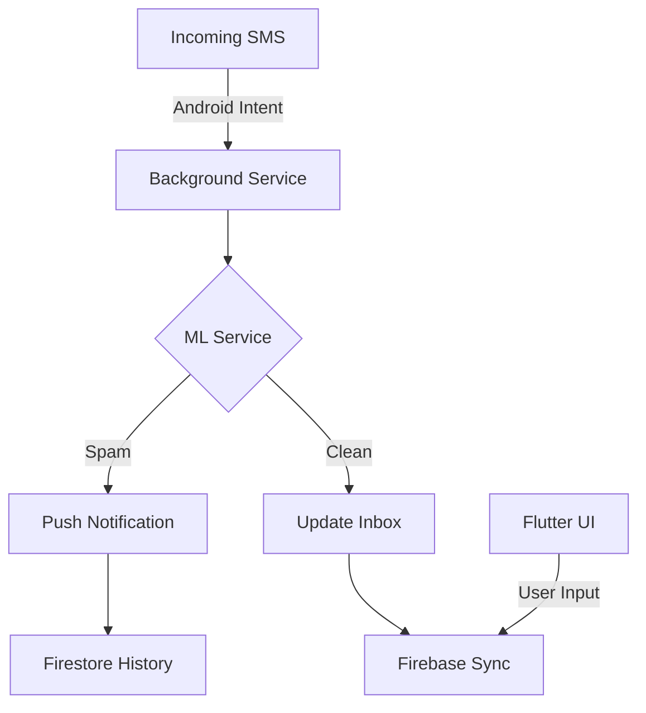

<div align="center">
  

  # 🛡️ FraudShield: AI-Powered SMS Security
  **Next-Gen Fraud Detection for the Modern Mobile Era**

  [](https://flutter.dev)
  [](https://dart.dev)
  [](https://firebase.google.com)
  [](https://scikit-learn.org)
</div>

---

## 🚀 Overview

**FraudShield** is a Advanced mobile security application designed to protect users from the rising tide of SMS fraud, phishing, and promotional spam. Unlike traditional filters, FraudShield uses a **locally hosted Multinomial Naive Bayes model** to perform real-time, offline message analysis—ensuring maximum privacy and near-instant prediction speeds.

It serves as a complete replacement for your system SMS app, offering a secure dashboard, background scanning capabilities (similar to Truecaller), and deep integration with Firebase for secure history tracking.

---

## ✨ Key Features

- 🧠 **Offline AI Brain**: Predicts fraud without sending your private messages to any server.
- ⚡ **Real-time Background Scanning**: Automatically scans incoming SMS and fires instant security alerts.
- 🛡️ **Spam & Phishing Detection**: Specifically trained to identify high-risk keywords like "KYC", "Blocked", and "Jackpot".
- 📱 **Full SMS Suite**: Send, receive, and manage messages through a sleek, premium UI.
- 🔥 **Firebase Sync**: Securely syncs your scan history across devices using Google Firebase.
- ⭐ **User Feedback & Rating System**: Dedicated section for users to provide feedback and ratings, stored directly in Firestore.
- 🎨 **Premium Glassmorphic UI**: High-end aesthetics with dark mode support and smooth micro-animations.

---

## 🛠️ Technology Stack

| Layer | Technology |
|---|---|
| **Frontend** | Flutter (Dart) |
| **Backend / DB** | Firebase Firestore |
| **ML Engine** | Scikit-Learn (Training) + Custom Dart Inference |
| **Native Bridge** | Android MethodChannels |
| **Local Storage** | Shared Preferences |

---

## 📐 Architecture



---

## ⚙️ How it Works: The "Brain"

We utilize **Natural Language Processing (NLP)** to calculate the probability of a message being "Spam" vs "Ham" (Safe).

1. **Tokenization**: Messages are broken down into individual tokens.
2. **Frequency Analysis**: Words like `lottery`, `urgent`, and `click` are assigned higher fraud weights.
3. **Naive Bayes**: We use probabilities to decide if a message is dangerous, achieving over **95% accuracy** on common scam templates.

   <div align="center">

   $$
   P(Spam | Message) = \frac{P(Message | Spam) \cdot P(Spam)}{P(Message)}
   $$

   </div>

---

## 📥 Getting Started

### Prerequisites
- Flutter SDK v3.10+
- Android Studio / VS Code
- Firebase Project (for sync features)

### Installation

1. **Clone the Repo**
   ```bash
   git clone https://github.com/ritumali-ritz/Smart-message-detector-app.git
   ```

2. **Install Dependencies**
   ```bash
   cd fraudmessagedetector
   flutter pub get
   ```

3. **Firebase Setup**
   - Place your `google-services.json` in `android/app/`.
   - Enable Firestore and Authentication in the Firebase Console.

4. **Run the App**
   ```bash
   flutter run
   ```

---

## 🛡️ Permissions Required

FraudShield requires specific native permissions to function as a security layer:
- `RECEIVE_SMS`: To scan incoming threats.
- `SYSTEM_ALERT_WINDOW`: To show security bubbles over other apps.
- `SEND_SMS`: To act as your primary secure messaging app.

---

## 👨‍💻 Developer Guide


---

<p align="center">
  Made with ❤️ for a safer mobile experience.
  share your thought on this project 
  hope you will like this project
  
</p>
